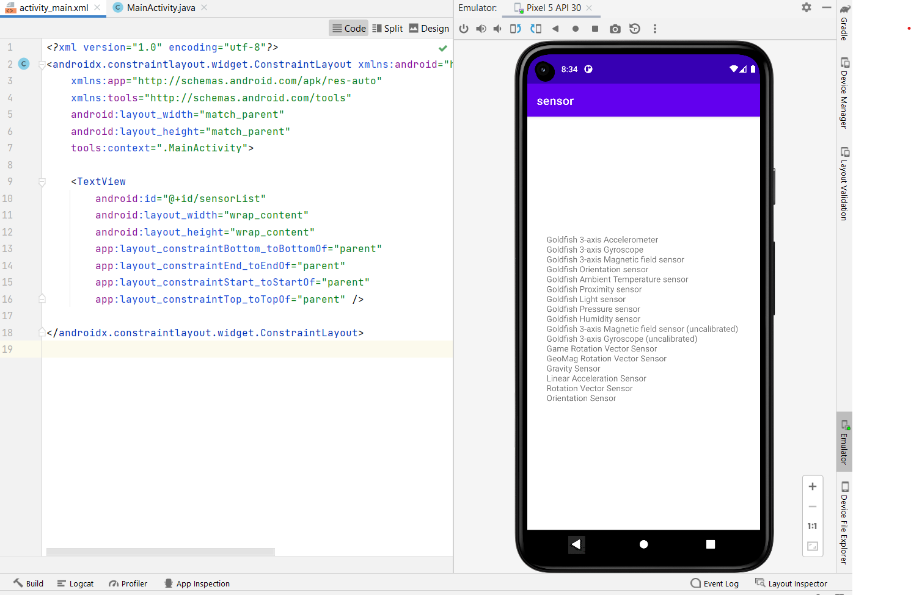

# Ex.No:4 Develop a simple application to display the avaliable sensor in android mobile devices using Sensor Manager in android studio.


## AIM:

To develop a sensor application to use the sensor manager class to identify and get the list of available sensors on a device. in Android Studio.

## EQUIPMENTS REQUIRED:

Android Studio(Min.required Artic Fox)

## ALGORITHM:

Step 1: Open Android Stdio and then click on File -> New -> New project.

Step 2: Then type the Application name as Sensor and click Next. 

Step 3: Then select the Minimum SDK as shown below and click Next.

Step 4: Then select the Empty Activity and click Next. Finally click Finish.

Step 5: Design layout in activity_main.xml.

Step 6: Display avaliable sensor in android mobile devices.

Step 7: Save and run the application.

## PROGRAM:
```
/*
Program to print the avaliable sensor in android mobile devices”.
Developed by:P.Ramsai
Registeration Number :212221240041
*/
```
## MainActivity.java:-
```
package com.example.sensors;

import androidx.appcompat.app.AppCompatActivity;

import android.content.Context;
import android.hardware.Sensor;
import android.hardware.SensorManager;
import android.os.Bundle;
import android.view.View;
import android.widget.TextView;

import org.w3c.dom.Text;

import java.util.List;

public class MainActivity extends AppCompatActivity {
    SensorManager mgr;
    TextView txtList;

    @Override
    protected void onCreate(Bundle savedInstanceState) {
        super.onCreate(savedInstanceState);
        setContentView(R.layout.activity_main);
        mgr = (SensorManager)getSystemService(Context.SENSOR_SERVICE);
        txtList = (TextView)findViewById(R.id.sensorList);
        List<Sensor> sensorsList = mgr.getSensorList(Sensor.TYPE_ALL);
        StringBuilder strBuilder = new StringBuilder();
        for(Sensor s: sensorsList){
            strBuilder.append(s.getName()+"\n");
        }
        txtList.setVisibility(View.VISIBLE);
        txtList.setText(strBuilder);
    }
}
```

## Activity_main.xml:-
```
<?xml version="1.0" encoding="utf-8"?>
<androidx.constraintlayout.widget.ConstraintLayout xmlns:android="http://schemas.android.com/apk/res/android"
    xmlns:app="http://schemas.android.com/apk/res-auto"
    xmlns:tools="http://schemas.android.com/tools"
    android:layout_width="match_parent"
    android:layout_height="match_parent"
    tools:context=".MainActivity">

    <TextView
        android:id="@+id/sensorList"
        android:layout_width="wrap_content"
        android:layout_height="wrap_content"
        app:layout_constraintBottom_toBottomOf="parent"
        app:layout_constraintEnd_toEndOf="parent"
        app:layout_constraintStart_toStartOf="parent"
        app:layout_constraintTop_toTopOf="parent" />

</androidx.constraintlayout.widget.ConstraintLayout>
```
## OUTPUT





## RESULT
Thus a Simple Android Application to display the avaliable sensor in android mobile devices using Sensor Manager in Android Studio is developed and executed successfully.
